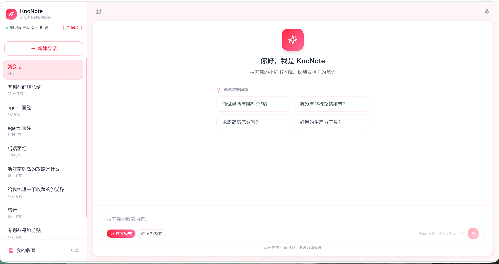

# KnoNote · 小红书收藏智能助手

把小红书收藏夹变成可对话的私人知识库。支持**语义检索**和 **AI 综合问答**双模式。



---

## 仓库结构

```
xhs-rag-assistant/
│
├── crawler/          # 爬虫模块← crawler/README.md
├── rag/              # RAG + AI + 知识库存储（负责人：李奕涵）← rag/README.md
├── frontend/         # 前端 React 应用（负责人：曾君毅）← frontend/README.md
│
├── main.py           # 后端 FastAPI 入口（负责人：莫仕玉）← 本文档
├── sync_xhs.sh       # 小红书收藏同步入口（执行 crawler/ingest.py）
├── start_server.sh   # 启动前后端服务
├── stop_server.sh    # 停止前后端服务
├── tools/            # 开发调试工具
│
├── data/             # 运行时数据（不进 git）← data/README.md
│   ├── notes.db      # SQLite 数据库：notes 表（元数据）+ chat_sessions 表（会话状态）
│   ├── chroma_db/    # ChromaDB 向量库
│   ├── cookies.json  # XHS Cookie（本地生成，不进 git）
│   ├── server.pid    # 后端服务 PID（启动后生成）
│   └── server.log    # 后端服务日志（启动后生成）
│
├── .env.example      # Key 模板
├── cookies.json.example # Cookie 文件模板
└── requirements.txt  # Python 依赖
```

---

## 小组分工

| 模块 | 目录/文件 | 负责人 | 详细文档 |
|------|----------|--------|---------|
| 爬虫 | `crawler/` |  | [crawler/README.md](crawler/README.md) |
| RAG + AI + 存储 | `rag/` | 李奕涵 | [rag/README.md](rag/README.md) |
| 后端 API | `main.py` | 莫仕玉 | 本文档 |
| 前端 | `frontend/` | 曾君毅 | [frontend/README.md](frontend/README.md) |
| 产品 | — | 高雅 | — |

---

## 快速启动

### 1. 安装依赖

```bash
# Python 依赖
pip install -r requirements.txt
playwright install chromium

# 前端依赖
cd frontend && npm install && cd ..
```

### 2. 配置密钥

```bash
cp .env.example .env
# 编辑 .env，填入 ZHIPUAI_API_KEY
```

### 3. 登录小红书

先在 Chrome 登录 [小红书网页版](https://www.xiaohongshu.com)。

### 4. 启动服务

```bash
./start_server.sh
```

脚本会同时启动 FastAPI 后端和 Vite 前端：

- 前端页面：`http://localhost:5173`
- 后端 API：`http://127.0.0.1:8000`
- 后端日志：`data/server.log`
- 前端日志：`data/frontend.log`

打开前端页面后，点击同步按钮同步收藏内容。

### 5. 停止服务

```bash
./stop_server.sh
```

脚本会停止后端和前端，并兜底释放 `8000` 与 `5173` 端口。

### 开发调试页面（可选）

```bash
python tools/export_notes_debug.py
```

默认生成 `data/notes_debug.html`。这个页面面向开发人员，用来核对每条收藏的：

- SQLite `content`：最终写入向量库、用于 embedding/RAG 的完整文本。
- SQLite `content_parts`：正文、图片 OCR、图片描述、视频转录的结构化拆分。
- ChromaDB `document`：当前向量库里实际保存的文本。
- SQLite `content` 与 ChromaDB `document` 是否一致。

---

## 后端 API 文档（main.py）

**负责人：莫仕玉**

`main.py` 是 FastAPI 后端，对前端暴露 8 个接口，调用 RAG 层完成核心逻辑。

### 架构

```
前端 HTTP 请求
     │
     ▼
main.py（FastAPI）
     ├── /api/query   →  rag.session_handler.handle_search()
     │                       └── rag.retriever.retrieve()
     ├── /api/stream  →  rag.session_handler.handle_stream()
     │                       ├── rag.followup.is_followup()
     │                       ├── rag.retriever.retrieve()
     │                       └── rag.chat.analyze_stream_with_history()
     ├── /api/notes   →  rag.storage.NoteStore.notes()
     ├── /api/stats   →  rag.storage.NoteStore.stats()
     ├── /api/updates →  rag.storage.NoteStore.updated_notes()
     ├── /api/sync    →  crawler.ingest（后台子进程）
     └── /api/sync/status → 进程级同步状态
```

会话状态（锁定的召回文档 + LLM 对话历史）持久化在 `data/notes.db` 的 `chat_sessions` 表中，由 `rag.storage.SessionStore` 管理。

### 端点详情

#### `GET /`

健康检查。

**响应：**
```json
{"status": "ok", "version": "0.1.0"}
```

---

#### `GET /api/stats`

存储统计信息。

**响应：**
```json
{"sqlite_total": 120, "chroma_indexed": 115}
```

---

#### `POST /api/query`

**search 模式专用**：语义检索，将召回文档存入会话，直接返回帖子列表。AI 分析请使用 `/api/stream`。

**请求体：**
```json
{
  "query":      "MySQL 联合索引有哪些注意事项",
  "user_id":    "640c4bcc000000002a0088a8",
  "mode":       "search",
  "top_k":      6,
  "session_id": "550e8400-e29b-41d4-a716-446655440000"
}
```

| 字段 | 类型 | 必填 | 默认 | 说明 |
|------|------|------|------|------|
| `query` | string | 是 | — | 用户问题 |
| `user_id` | string | 是 | — | 用户 ID（严格隔离）|
| `mode` | string | 否 | `"search"` | 此接口只接受 `"search"` |
| `top_k` | int | 否 | `6` | 检索条数，1~20 |
| `session_id` | string | 是 | — | 前端会话 UUID，用于关联后端状态 |

**响应：**
```json
{
  "mode": "search",
  "answer": null,
  "sources": [
    {
      "note_id":   "69ef1b91...",
      "title":     "字节后端一面复盘",
      "note_url":  "https://www.xiaohongshu.com/explore/...",
      "cover_url": "https://sns-img-hw.xhscdn.com/...",
      "distance":  0.31
    }
  ],
  "total": 2
}
```

**错误码：**

| 状态码 | 原因 |
|--------|------|
| 400 | mode 不是 `"search"` |
| 422 | query / user_id / session_id 为空（Pydantic 校验） |
| 500 | 检索内部异常 |

---

#### `POST /api/stream`

**analysis 模式专用（SSE 流式）**：AI 分析总结，支持三条路径：

- **首次分析**：重新检索，清空历史，生成首次回答
- **搜索后切换分析**：复用搜索时已锁定的 docs，不重新检索
- **追问**：检测到当前问题是上一轮的延伸时，跳过检索，延续 LLM 对话历史

**请求体：**
```json
{
  "query":      "有什么需要注意的地方",
  "user_id":    "640c4bcc000000002a0088a8",
  "mode":       "analysis",
  "top_k":      6,
  "session_id": "550e8400-e29b-41d4-a716-446655440000"
}
```

| 字段 | 类型 | 必填 | 默认 | 说明 |
|------|------|------|------|------|
| `query` | string | 是 | — | 用户问题 |
| `user_id` | string | 是 | — | 用户 ID（严格隔离）|
| `mode` | string | 否 | `"search"` | 此接口只接受 `"analysis"` |
| `top_k` | int | 否 | `6` | 检索条数，1~20 |
| `session_id` | string | 是 | — | 前端会话 UUID |

**SSE 事件格式（`text/event-stream`）：**
```
data: {"type": "sources", "sources": [...], "total": 2}

data: {"type": "chunk", "content": "根据你的收藏笔记..."}

data: {"type": "done"}
```

追问路径下 `sources` 与上一轮相同（复用已锁定 docs）。出错时推送 `{"type": "error", "message": "..."}` 后终止流。

**错误码：**

| 状态码 | 原因 |
|--------|------|
| 400 | mode 不是 `"analysis"` |
| 422 | query / user_id / session_id 为空 |
| 500 | 处理内部异常 |

---

#### `GET /api/updates`

内容有变化的笔记列表，用于前端展示「内容已更新」提醒徽章。

**查询参数：**

| 参数 | 类型 | 必填 | 说明 |
|------|------|------|------|
| `user_id` | string | 是 | 用户 ID |

**响应：**
```json
{"total": 3, "notes": [...]}
```

---

#### `GET /api/notes`

用户笔记列表（分页），用于前端侧边栏展示。

**查询参数：**

| 参数 | 类型 | 必填 | 默认 | 说明 |
|------|------|------|------|------|
| `user_id` | string | 是 | — | 用户 ID |
| `page` | int | 否 | 1 | 页码 |
| `page_size` | int | 否 | 20 | 每页条数，最大 100 |

**响应：**
```json
{
  "total": 120,
  "page": 1,
  "page_size": 20,
  "notes": [
    {
      "note_id":    "69ef1b910000000035024d5e",
      "title":      "字节后端一面复盘",
      "content":    "正文\\n[图片文字]: ...\\n[图片描述]: ...",
      "content_parts": {
        "body": "正文",
        "images": [
          {
            "url": "https://...",
            "ocr_text": "...",
            "description": "..."
          }
        ],
        "video_transcript": ""
      },
      "tags":       ["面经", "字节跳动"],
      "cover_url":  "https://...",
      "note_url":   "https://...",
      "likes":      1024,
      "note_type":  "image",
      "crawled_at": "2024-01-15T10:30:00",
      "indexed":    1,
      "is_collected": 1,
      "archived_at": ""
    }
  ]
}
```

---

#### `POST /api/sync`

触发收藏夹同步（异步，后台执行）。等价于运行 `sync_xhs.sh`。若已有任务运行则返回 409。

**请求体（可选）：**
```json
{"user_id": "640c4bcc000000002a0088a8"}
```

**响应：**
```json
{"status": "started"}
```

---

#### `GET /api/sync/status`

查询同步任务状态。

**响应：**
```json
{
  "running":   false,
  "error":     null,
  "last_sync": "2026-05-21T10:30:00+00:00"
}
```

---

### CORS 配置

当前允许以下来源跨域（开发环境）：
- `http://localhost:3000`
- `http://localhost:5173`
- `http://127.0.0.1:3000`
- `http://127.0.0.1:5173`

生产部署时修改 `main.py` 中的 `allow_origins`。

---

## 各模块接口契约（跨模块协作参考）

> 各模块开发时只需关注自己的"输入来源"和"输出目标"。

```
爬虫（莫仕玉）          RAG（李奕涵）                    后端（莫仕玉）              前端（曾君毅）
─────────────          ─────────────                    ─────────────             ─────────────
fetch_collect_list()   index_note()                     POST /api/query      ←→   useApi.queryApi()
  → list[meta]    →→   index_notes()                    POST /api/stream     ←→   useApi.queryStreamApi()
                                                        GET  /api/notes      →→   Sidebar
fetch_note_detail()    session_handler.handle_search()  GET  /api/stats      →→   Sidebar stats
  → note dict     →→   index_note(note)                 POST /api/sync       ←→   useSync()
                       session_handler.handle_stream()  GET  /api/sync/status ←→  useSync()
                       followup.is_followup()
                       storage.SessionStore
```

---

## 环境变量

| 变量 | 说明 | 必填 |
|------|------|------|
| `ZHIPUAI_API_KEY` | 智谱 API Key（embedding / chat / vision） | 必填 |
| `OPENAI_API_KEY` | OpenAI Key（Whisper 视频转录） | 有视频时必填 |

---

## 开发规范

### Git 分支

| 分支 | 说明 |
|------|------|
| `main` | 稳定版本，只通过 PR 合入 |
| `feat/rag-*` | RAG/AI 功能（李奕涵） |
| `feat/crawler-*` | 爬虫/后端（莫仕玉） |
| `feat/frontend-*` | 前端（曾君毅） |

### PR 前检查清单

- [ ] `retrieve()` 调用时传入了 `user_id`（严禁跨用户泄露）
- [ ] 新增 Key/Token 走 `os.getenv()`，未硬编码
- [ ] `data/cookies.json`、`.env`、`data/` 运行产物在 `.gitignore` 中
- [ ] 本地运行 `python -m crawler.test_crawl` 通过

---

## feature/favorite-update-alerts 分支变更说明

本分支相对 `main` 增加了“收藏帖子更新提醒”能力，目标是在用户收藏的小红书帖子标题或正文真的发生变化后，在前端提醒用户是哪篇帖子更新了。

### 后端能力

- `GET /api/updates`：读取本地数据库中当前用户未读的收藏更新提醒，不访问小红书。
- `POST /api/updates/seen`：把某篇帖子或全部帖子更新提醒标记为已读。
- `POST /api/updates/check`：手动触发一次轻量快检，复用登录态打开收藏帖详情页，只抓取标题和正文，不执行图片 Vision、OCR、视频转录或向量化。
- `GET /api/updates/check/status`：查询轻量快检运行状态、最近错误、发现更新数量和最后完成时间。
- `POST /api/sync` 保持原有完整同步逻辑不变，仍负责完整爬取、入库和向量化。

### 前端交互

- 打开前端时不会自动爬取小红书，也取消了每 5 分钟自动快检，避免频繁访问导致账号风险。
- 顶部“同步”按钮保持原样，仍调用完整同步。
- “我的收藏”列表右上角刷新按钮是当前唯一触发收藏更新快检的入口。
- 前端继续每 60 秒轮询 `GET /api/updates`，该轮询只读本地数据库，不会爬取小红书。
- 检测到真实更新后，前端会显示全局弹窗提醒，并在“我的收藏”入口/收藏卡片上显示未读数量或“已更新”状态。
- 用户点击弹窗或对应收藏卡片后，会调用 `POST /api/updates/seen` 标记已读。

### 更新判定和存储

- 快检只比较 `title + 正文` 的文字签名，忽略点赞数、浏览量、图片 OCR、图片描述和视频内容。
- 完整同步和轻量快检使用同一套文字签名算法：优先取 `content_parts.body`，没有时才回退到 `content`。
- `notes` 表新增/使用 `text_update_hash` 与 `text_seen_hash` 保存当前文字版本和用户已读版本。
- 首次完整同步或首次快检只建立基线，设置 `text_update_hash = text_seen_hash`，不会提醒用户。
- 只有之后标题或正文再次变化，且 `text_update_hash != text_seen_hash` 时，才会返回未读更新。
- 快检发现文字变化后会先更新本地标题/正文和更新时间提醒；完整 Vision/向量化仍留给后续完整同步处理。

### 相关文件

- `main.py`：新增更新提醒与轻量快检 API，并处理快检和完整同步的互斥。
- `crawler/xhs_crawler.py`：新增轻量详情页文本快照抓取逻辑。
- `rag/storage/sqlite_store.py`：新增文字签名、首次基线、已读标记和轻量文本更新写入逻辑。
- `frontend/src/hooks/useApi.js`：封装更新提醒读取、标记已读和手动快检状态。
- `frontend/src/App.jsx`、`frontend/src/components/Sidebar.jsx`：接入弹窗、未读标记和“我的收藏”刷新按钮触发快检。
- `tests/test_archive_sync.py`：覆盖首次基线不提醒、真实文字变化才提醒、非收藏/非当前用户不提醒、点击后已读等行为。
